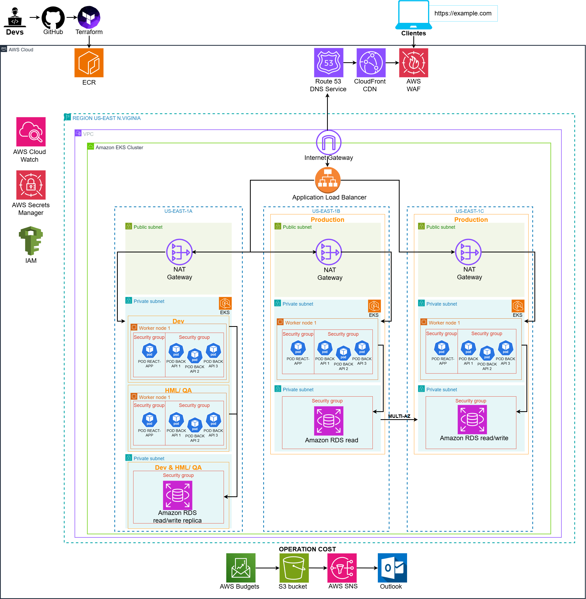
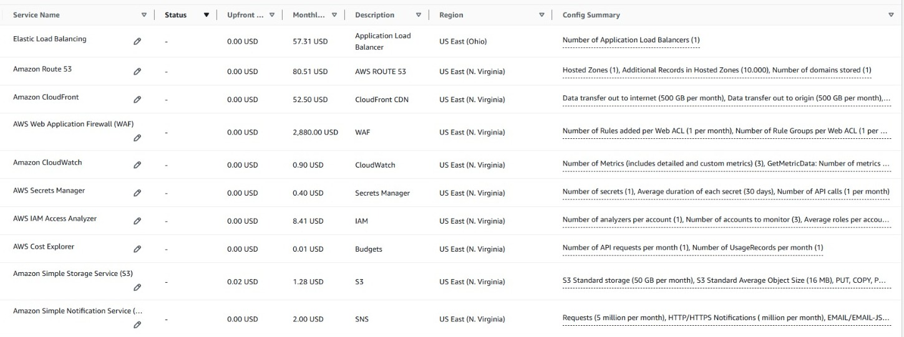

# Projeto migração com AWS MGN e Kubernetes

Este projeto é uma atividade conceitual solicitada pela equipe de estágio da Compass.UOL. O objetivo é fazer dois diagramas, um demonstrando como seria o processo de Lift-and-Shift de três servidores locais para a AWS. O outro diagrama demonstrando como seria a migração desse conjunto para uma arquitetura com Kubernetes.

# Contexto 🗎

Nós somos da empresa "Fast Engineering S/A" e gostaríamos de uma solução dos senhores(as), que fazem parte da empresa terceira "TI SOLUÇÕES INCRÍVEIS".

Nosso eCommerce está crescendo e a solução atual não está atendendo mais a alta demanda de acessos e compras que estamos tendo.

Atualmente usamos:

- 1 servidor para `Banco de Dados Mysql`

  - 500 GB de dados
  - 10 GB de RAM
  - 3 Core CPU

- 1 servidor com 3 APIs, com o Nginx servindo de balanceador de carga e que armazena estáticos como fotos e links - `Back-End`

  - 5 GB de dados
  - 4 GB de RAM
  - 2 Core CPU

- 1 servidor para a aplicação utilizando REACT – `Front-End`
  - 5 GB de dados
  - 2 GB de RAM
  - 1 Core CPU

Diagrama da situa;cão atual

Queremos modernizar esse sistema para a AWS, precisamos seguir as melhores práticas arquitetura em Cloud AWS, a nova arquitetura deve seguir as seguintes diretrizes:

- Ambiente Kubernetes;
- Banco de dados gerenciado (PaaS e Multi AZ);
- Backup de dados;
- Sistema para persistência de objetos (imagens, vídeos etc.);
- Segurança;

Porém antes da migração acontecer para a nova estrutura, precisamos fazer uma migração “lift-and-shift” ou “as-is”, o mais rápido possível, só depois que iremos promover a modificação para a nova estrutura em Kubernetes.

---

## Etapa 1 - Migração Lift-and-Shift com o AWS Application Migration Service

Diagrama

1. Instalação do **AWS Replication Agent** que se conecta com **AWS Migration Service**. Solução automatizada para migrar as aplicações locais para a nuvem AWS.
2. Os **Servidores locais** e os **servidores de replicação do AWS MGN** que são executados na sub-rede da área de preparação devem se comunicar continuamente com os **endpoints do AWS MGN na porta 443** para fins de autenticação, configuração e monitoramento.
3. Quando o servidor de replicação ou de conversão é inicializado, ele se conecta a um **bucket do S3 para baixar software e arquivos de configuração**.
4. O AWS MGN usa, como padrão, **computação da EC2 do tipo t3-micro** aumentando ou diminuindo o processamento conforme necessário.
5. Conexões entre os servidores locais e os servidores de replicação são criadas por **AWS Direct Connect ou VPN** (conforme preferência). Os dados são **criptografados em trânsito** com chave de criptografia AES de 256 bits por padrão.
6. Armazenamentos da **Elastic Block Store** são criados do mesmo tamanho dos discos do sistema de origem para manter os dados do ambiente de origem **sincronizados na AWS**.
7. Para a migração do banco de dados, é usado o serviço **AWS Database Migration Service**. E o banco de dados na AWS passa a ser usado pelo **Amazon RDS**.
8. Uma das funções do servidor de replicação é emitir uma chamada de API para **tirar snapshots dos volumes de preparação do EBS** durante a replicação. Para isso, a conectividade com um endpoint da API do EC2 na porta 443 também deve estar em vigor.
9. A subnet da área de testes inicia as instâncias conforme a configuração do **modelo de execução**. Essas instâncias de testes são conectadas a **cópias recentes dos armazenamentos EBS da área de preparação**.

> [!important]
> Essas cópias não são mais sincronizadas com os servidores locais.

10. Pode ser usado uma conexão via **proxy**. É necessário quando uma empresa precisa de **auditoria do processo** ou quando **não é permitido uma conexão direta com a AWS**.
11. O **SSM** é usado para **gerenciar essas instâncias de forma automatizada**.

# Informações importantes ⬇️

### `Quais atividades são necessárias para a migração?`

1. Instalar o AWS Replication Agent para se conectar com AWS Migration Service;
2. Migrar o banco de dados com o AWS DMS;
3. Configurar o modelo de execução para as novas instâncias;
4. Testar as novas instâncias;
5. Migrar definitivamente para a AWS.

---

### `Quais as ferramentas vão ser utilizadas?`

|                                                                                                                                                                        Ferramenta |     | Descrição                                                                               |
| --------------------------------------------------------------------------------------------------------------------------------------------------------------------------------: | :-- | --------------------------------------------------------------------------------------- |
| </img> | MGN | Automação para migrar as aplicações locais para a nuvem AWS.                            |
|                                                         </img> | EC2 | Computação para replicação dos servidores locais e para testes com servidores migrados. |
|                                                                           </img> | S3  | O MGN se conecta com buckets S3 para baixar softwares e arquivos de configuração.       |
|                                                                               </img> | EBS | Para criar armazenamentos EBS idênticos aos discos dos servidores locais.               |
|                 </img> | RDS | Para gerenciar o novo banco de dados na AWS.                                            |
|              </img> | DMS | Para migrar o banco de dados do servidor local para o Amazon RDS.                       |

---

### `Qual o diagrama da infraestrutura na AWS?`

Diagrama após a Migração ⬆️

---

### `Como serão garantidos os requisitos de Segurança?`

Os dados são **criptografados em trânsito** com chave de criptografia AES de 256 bits por padrão.

---

### `Como será realizado o processo de Backup?`

O sistema será distribuido em duas zonas de disponibilidade. Cada zona terá uma instância anexada com seu volume EBS sincronizado. O Banco de dados terá sua réplica na outra zona de disponibilidade.

---

### `Qual o custo da infraestrutura na AWS (AWS Calculator)?`

`Durante a migração` ⬇️

Valor total por mês: **U$ 276,58**

---

`Após a migração` ⬇️

Valor total por mês: **U$ 195,01**

---

## Etapa 2 - Modernização/ Kubernetes

A empresa Fast Engineering S/A solicitou uma modernização da sua arquitetura AWS, tendo como requisitos, os seguintes tópicos abaixo:

- Ambiente Kubernetes.
- Banco de dados gerenciado (PaaS e Multi AZ).
- Backup de dados.
- Sistema para persistência de objetos (imagens, vídeos etc).
- Segurança.

Sendo assim, construimos uma proposta de modernização da arquitetura da Fast Engineering. Todas as informações relevantes sobre a arquitetura proposta, estão abaixo, nos seguintes tópicos.

# Informações importantes ⬇️

---

### `Quais atividades são necessárias para a modernização?`

**Requisitos**

- Conta AWS (Para usar a AWS CLI)
- VSCODE
- Terraform
- Docker
- Conta Github
- VPC(EKS VPC)

**Atividades importantes para o processo de modernização**

1. Preparação do ambiente:

- O docker será usado para criar as imagens com as aplicações.
- O GitHub será configurado para armazenar o código Terraform e workflows do Github actions.
- Os segredos serão adicionados no repositório para armazenar as credencias da AWS (ex: AWS_ACCESS_KEY_ID, AWS_SECRET_ACCESS_KEY).
- O Terraform será instalado em uma máquina local para testar e desenvolver os scripts que serão usados.
- Criação do cluster EKS com Terraform através da criação de arquivos de configuração.
  Cração do Node Group.
- Configuração do github actions.

2. Migração dos recursos para o EKS:

- Configuração do kubectl para interagir com o cluster EKS.
- Criação dos manifestos(deployments e serviços) Kubernetes YAML para implantar aplicativos no cluster.
- Implantação(apply) dos recursos no cluster EKS.
- Verificaçãp do estado dos recursos no cluster EKS na zona de Devs.
- Realização de testes na aplicação e configuração do monitoramento e alertas para o cluster EKS.

3. O time de HML e QA irá prosseguir com os testes antes que a aplicação seja de fato distribuída.

---

### `Quais ferramentas serão utilizadas?`

| Ferramenta                                                                                                                                                                    | Descrição                                                                                                                                                                                                                                                                                                                                     |
| ----------------------------------------------------------------------------------------------------------------------------------------------------------------------------- | --------------------------------------------------------------------------------------------------------------------------------------------------------------------------------------------------------------------------------------------------------------------------------------------------------------------------------------------- |
| </img>                                                                                                                                   | **ECR**: Ele é um serviço AWS usado para armazenar e gerenciar containers, ele serve como um repositório privado de imagens.                                                                                                                                                                                                                  |
| </img>                                                                                                                                   | **EKS**: Computação para replicação dos servidores locais e para testes com servidores migrados. É um serviço que gerencia os clusters, worker nodes kubernetes, master nodes, ele também é responsável pela escalabilidade e backups.                                                                                                        |
| </img>                                                                                                                                   | **RDS for MySQL**: O AWS RDS(Relational Database Service) é um banco de dados.                                                                                                                                                                                                                                                                |
| </img>                                                                                                                                   | **NAT Gateway**: Permite que os serviços dentro das subnetes privadas tenham acesso à internet, mas os serviços continuam inacessíveis para quem não permissão.                                                                                                                                                                               |
| </img>                                                                                                                                    | **Internet Gateway**: Permite que os serviços dentro de uma VPC se comuniquem com a Internet.                                                                                                                                                                                                                                                 |
| </img>                                                                                                                                   | **Application Load Balancer**: Para gerenciar o tráfico, balanceia o tráfico para os Pods/Instâncias.                                                                                                                                                                                                                                         |
| </img>      | **Route 53**: Gerenciamento de DNS para domínios e zonas hospedadas, durante a criação do Route 53, em hosted zones, ele possui uma lista de registros DNS, e checa se o domínio solicitado(quando o usuário entra na aplicação web) combina com o IP do load balancer, se sim, a solicitação segue e o usuário consegue acessar a aplicação. |
| </img>    | **CloudFront**: CDN para entrega de conteúdo com baixa latência, ele é um Content Deliver Service e é usado para entregar conteúdos como imagens, vídeos ou dados estáticos ou dinâmicos ao redor do mundo.                                                                                                                                   |
| </img>             | **WAF**: Firewall para proteger aplicativos web contra ataques comuns.                                                                                                                                                                                                                                                                        |
| </img>                                                                                                                            | **CloudWatch**: Monitoramento e coleta de métricas em tempo real.                                                                                                                                                                                                                                                                             |
| </img> | **Secrets Manager**: Gerenciamento seguro de credenciais e segredos, as variáveis de ambiente.                                                                                                                                                                                                                                                |
| </img>                                                                                                                                   | **IAM**: Gerenciamento de permissões e acesso seguro a recursos da AWS.                                                                                                                                                                                                                                                                       |
| </img>                                                                                                                                | **Budgets**: Controle de orçamento e alertas de custos.                                                                                                                                                                                                                                                                                       |
| </img>                                                                       | **S3 Bucket**: Armazenamento escalável para dados e relatórios.                                                                                                                                                                                                                                                                               |
| </img>                                                                                                                                   | **AWS SNS**: Simple Notification Service é um serviço de mensagens para notificações em tempo real.                                                                                                                                                                                                                                           |

---

### `Qual o diagrama da infraestrutura na AWS?`

**Diagrama do ambiente na AWS após a modernização para Kubernetes**

##### Descrição

Descrição da aqrquitetura apresentada acima, siga os links para mais informações.

1. Primeiramente os **Devs**(Desenvolvedores/developers) através de uma [pipeline Terraform integrada com o GitHub actions e a AWS](pipelineWorkflow.md), faz o deploy da infra Terraform para a AWS, e as imagens dos containers são armazenadas dentro do **ECR**(Elastic Container Repository).
2.

---

### `Como serão garantidos os requisitos de Segurança?`

A arquitetura utiliza dos seguintes itens para garantir a segurança:

- **Subnetes Privadas**: Limitando o acesso indevido, criando assim uma zona restrita.
- **AWS Secrets Manager**: A centralização das variáveis de ambientes ou credenciais reduz o risco de vazamentos ou uso indevido, além de fazer rotação automática de segredos como senhas de bancos de dados, chaves de API e tokens de acesso seguindo.
- **IAM roles/policies**: Utilização de lista de permissões para grupos de usuários e controle de acesso a segredos, limitando o acesso indevido ao ambiente.
- **AWS WAF**: Através da utilização do WAF, Firewall, para criar regras para bloquear padrões de tráfego malicioso como Injeção de SQL, Cross-Site Scripting, Força Bruta ou até mesmo Bots Maliciosos. O WAF também envia métricas para o CloudWatch, permitindo o monitoramento do tráfego e assim ajudando na identificação de padrões de ataques.
- **AWS CloudFront**: Integrado ao WAF, ele protege aplicações distribuídas globalmente.
- **Application Load Balancer**: Integrado ao WAF, ele protege as aplicações hospedadas no EKS.

---

### `Como será realizado o processo de Backup?`

- **Terraform**: Como o Terraform faz esse processo de automatização da montagem do cluster EKS, em caso de qualquer perda do ambiente, ele fará esse processo de reconstrução do cluster.
- **RDS**: O RDS sendo configurado de forma MULTI-AZ, garante uma alta disponibilidade, além de fornecer backups automáticos e snapshots manuais.

### `Qual o custo da infraestrutura na AWS (AWS Calculator) mensalmente?`

`Levantamento com todas as tecnologias utilizadas` ⬇️

Valor total por mês: **US$ 3,821.87**

[Link levantamento](https://calculator.aws/#/estimate?id=b40b2c23586cedadf4a3ecc92bdc84463720ebae)

---

## Conclusão

Portanto, assim como solicitado pela empresa Fast Egineering S/A, conseguimos desenvolver as duas arquiteturas e o levantamento mensal de seus custos.

Muito obrigada!
